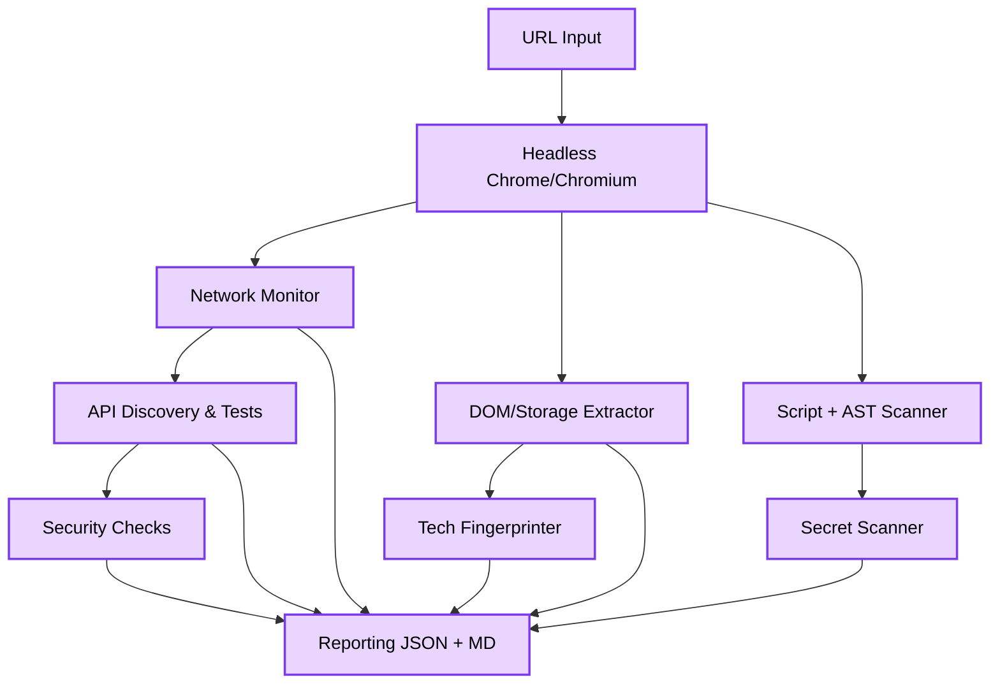
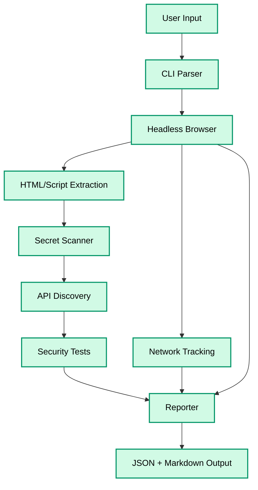
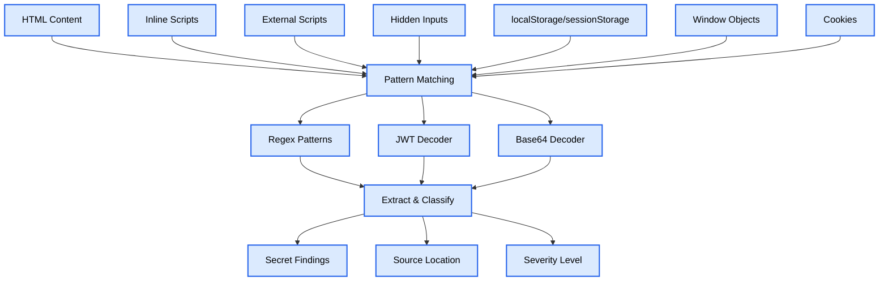

# 🦀 Corrode

**High-performance security scanner for finding exposed credentials, secrets, and vulnerabilities in web applications**

Built with Rust and chromiumoxide for blazing-fast scanning with comprehensive security analysis.

[](https://www.rust-lang.org/)
[](LICENSE)

## Project Structure

```
src/
├── api/                  # API discovery + testing harnesses
├── cli.rs                # CLI definitions
├── config.rs             # Config normalization
├── detectors/            # Secrets, DOM, JS (and AST) collectors
├── network/              # Network monitor
├── reporting/            # JSON/Markdown report writers
├── scanner/              # Browser orchestration + workflow
├── types.rs              # Shared data structures
└── main.rs               # Entry point
fixtures/                 # Static fixture pages for local testing
corrode-output/           # Default output directory (per scan)
```

## Architecture

### High-Level Architecture



### Scanning Workflow



### Secret Detection Pipeline



## Features

### Core Scanning Capabilities
- ⚡ **Fast Headless Scanning** - Optimized Chromium workflow for low-latency scans
- 🔍 **Deep Analysis** - Extracts and scans HTML, JavaScript bundles, inline scripts, and external resources
- 🌐 **Network Monitoring** - Tracks all HTTP requests, API calls, and third-party domains
- 🎯 **Pattern Matching** - Detects 30+ types of secrets and credentials
- 📊 **Comprehensive Reporting** - JSON results and detailed Markdown reports per site

### Advanced Analysis
- 🔐 **API Discovery** - Automatically discovers API endpoints from JavaScript code
- 🎯 **API Vulnerability Testing** - Tests for authentication bypass, IDOR, and other API vulnerabilities
- 🛠️ **Technology Detection** - Identifies 40+ frameworks, libraries, and services in use
- 🔎 **DOM Analysis** - Analyzes forms, hidden inputs, iframes, meta tags, and data attributes
- 🍪 **Cookie Security Analysis** - Checks for insecure cookie configurations
- 🪟 **Window Object Inspection** - Extracts sensitive data from window objects (Next.js, Nuxt, etc.)
- 📍 **Source Map Detection** - Identifies exposed source maps

## Installation

### Install via Cargo (planned crates.io release)

```bash
cargo install corrode
```

For local development (from source):
```bash
git clone https://github.com/ul0gic/corrode.git
cd corrode
cargo build --release
./target/release/corrode --url https://example.com
```

### Requirements

| Requirement          | Details                                    |
| -------------------- | ------------------------------------------ |
| Rust                 | 1.70+ (install from [rustup.rs](https://rustup.rs)) |
| Chrome/Chromium      | Installed and discoverable; auto-detected, or override with `--chrome-bin`/`CHROME_BIN` |
| OS                   | Linux/macOS                                |

## Usage

### Command Line Options

| Flag / Option        | Description                                                             | Default           | Required |
| -------------------- | ----------------------------------------------------------------------- | ----------------- | -------- |
| `--url <URL>`        | Target URL to scan                                                      | –                 | ✅       |
| `-o, --output <DIR>` | Output directory (`<output>/<domain>/scan_result.json`, `REPORT.md`)    | `corrode-output`  |          |
| `--chrome-bin <PATH>`| Path to Chrome/Chromium binary (overrides auto-detect)                  | auto-detect       |          |
| `-t, --timeout <s>`  | Page-load timeout in seconds                                            | `30`              |          |
| `-v, --verbose`      | Verbose progress + findings                                             | off               |          |
| `--format <fmt>`     | Output format: `json`, `md`, or `both`                                  | `both`            |          |
| `-h, --help`         | Show help                                                               | –                 |          |
| `-V, --version`      | Show version                                                            | –                 |          |

Chrome/Chromium is auto-detected via PATH and common install locations. Override with `--chrome-bin <path>` or `CHROME_BIN`/`CHROMIUM_BIN` if you have a nonstandard install.

### Usage Examples

- Standard scan:
  ```bash
  ./target/release/corrode --url https://example.com
  ```
- Custom output directory:
  ```bash
  ./target/release/corrode --url https://example.com -o recon-$(date +%Y%m%d)
  ```
- Extended timeout for slow sites:
  ```bash
  ./target/release/corrode --url https://example.com -t 60 -v
  ```
- Explicit Chrome binary override:
  ```bash
  ./target/release/corrode --url https://example.com --chrome-bin "/Applications/Google Chrome.app/Contents/MacOS/Google Chrome"
  ```

## Detected Secrets & Credentials

Corrode detects 30+ types of secrets and credentials:

### Authentication & Authorization
- 🔑 **JWT Tokens** - Including Supabase service_role detection
- 🔑 **Bearer Tokens** - Authorization header tokens
- 🔑 **Basic Auth** - Base64 encoded credentials
- 🔐 **OAuth Client Secrets** - Google OAuth and others
- 🔒 **Private Keys** - RSA, EC, and OpenSSH private keys

### Cloud Providers
- ☁️ **AWS Access Keys** - AKIA keys
- ☁️ **AWS Secret Keys** - Secret access keys
- ☁️ **AWS ARN** - Amazon Resource Names
- 🔥 **Firebase API Keys** - AIza keys
- 🗄️ **Supabase URLs** - Project URLs
- 🗄️ **Supabase Anon Keys** - Anonymous keys
- ☁️ **Heroku API Keys** - UUID format keys

### Payment & Financial
- 💳 **Stripe Live Keys** - sk_live keys
- 💳 **Stripe Restricted Keys** - rk_live keys

### Communication & Collaboration
- 💬 **Slack Tokens** - xox tokens
- 💬 **Slack Webhooks** - Webhook URLs
- 📧 **SendGrid Keys** - SG keys
- 📧 **Mailgun Keys** - API keys
- 📧 **Mailchimp Keys** - API keys
- 📞 **Twilio Keys** - SK keys
- 📞 **Twilio Account SIDs** - AC identifiers

### Version Control & Development
- 🐙 **GitHub Tokens** - Personal access tokens (classic and fine-grained)
- 🦊 **GitLab Tokens** - Personal access tokens
- 💬 **Discord Tokens** - Bot and webhook tokens

### Database Connection Strings
- 🗄️ **PostgreSQL URLs** - Connection strings with credentials
- 🗄️ **MongoDB URLs** - Connection strings with credentials
- 🗄️ **MySQL URLs** - Connection strings with credentials
- 🗄️ **Redis URLs** - Connection strings with credentials

### Other
- 🌐 **IP Addresses** - Internal IP exposure
- 🔗 **JWT in URLs** - Tokens passed in query parameters

## Vulnerability Detection

### API Security Testing
- 🔓 **Authentication Bypass** - Tests if APIs are accessible without credentials
- 🎯 **IDOR (Insecure Direct Object Reference)** - Tests for unauthorized access to objects
- 🔑 **Missing Authentication Checks** - Identifies endpoints that don't validate tokens
- 📂 **Publicly Accessible APIs** - Finds APIs returning data without authentication
- ⚠️ **Mass Assignment** - Tests for dangerous parameter injection

### Security Issues
- 🍪 **Insecure Cookies** - Missing Secure, HttpOnly, or SameSite flags
- 🐛 **Debug Mode Detection** - Identifies debug mode enabled in production
- 📍 **Source Map Exposure** - Flags exposed source maps that aid reverse engineering
- 🔍 **CORS Issues** - Detects problematic CORS configurations
- 🔓 **Mixed Content** - Identifies insecure resources on HTTPS pages

### Technology Detection

Corrode automatically identifies 40+ technologies:

**Frameworks**: React, Vue.js, Angular, Svelte, Solid.js, Next.js, Nuxt.js, Remix, Gatsby
**Backend-as-a-Service**: Supabase, Firebase, Appwrite, AWS Cognito
**Authentication**: Auth0, Clerk, Okta
**Payment**: Stripe, PayPal, Square, Braintree
**Analytics**: Google Analytics, Mixpanel, Segment, Amplitude, HubSpot
**CMS**: WordPress, Drupal, Webflow, Contentful, Sanity
**Libraries**: jQuery, Bootstrap, Tailwind CSS, Material-UI
**State Management**: Redux, MobX, Zustand, Apollo Client, Relay

## Roadmap & Features in Progress

- [ ] GraphQL schema extraction and testing
- [ ] WebSocket monitoring and analysis
- [ ] Enhanced header security analysis
- [ ] SQL injection pattern detection in discovered endpoints
- [ ] XSS vulnerability testing
- [ ] Enhanced CORS misconfiguration detection
- [ ] Browser storage (localStorage/sessionStorage) security analysis
- [ ] Custom pattern definitions via config file
- [ ] HTML report generation
- [ ] Integration with vulnerability databases

## Disclaimer

**IMPORTANT: For Authorized Security Testing Only**

This tool is designed for legitimate security research, penetration testing, and vulnerability assessment. By using Corrode, you agree to the following:

- ✅ Only scan websites and applications you own or have explicit written permission to test
- ✅ Use this tool for defensive security purposes, security research, and authorized penetration testing
- ✅ Comply with all applicable laws and regulations in your jurisdiction
- ✅ Respect responsible disclosure practices for any vulnerabilities discovered

**We are NOT responsible for:**
- ❌ Any unauthorized scanning or testing of websites without permission
- ❌ Any damage, legal consequences, or violations resulting from misuse of this tool
- ❌ Any actions taken based on the scan results
- ❌ False positives or missed vulnerabilities in scan results

**Legal Notice**: Unauthorized access to computer systems is illegal under laws such as the Computer Fraud and Abuse Act (CFAA) in the United States and similar legislation in other countries. Always obtain proper authorization before testing.

Corrode is provided by **ul0gic** on an "as-is" basis with no warranty. You assume all responsibility for how you use the tool.

## License

Corrode is licensed under the **GNU Affero General Public License v3.0 (AGPL-3.0)**. See `LICENSE` for the complete terms. Highlights:
- ✅ Any modifications or derivative works must remain AGPL and be published when distributed or offered as a hosted service.
- ✅ Keep attribution to **ul0gic** and the Corrode project in downstream forks and hosted deployments.
- ✅ Free for security research, internal assessments, and community contributions—commercial users simply follow the same AGPL requirements.
- ⚠️ The software is provided without warranty; use it only when you have authorization.

## Contributing

Read `CONTRIBUTING.md` before opening a PR. Key points:
- ✅ All patches are accepted under AGPL-3.0 and you confirm you have the right to contribute the code.
- ✅ Public shoutouts, talks, and demos must credit Corrode and ul0gic.
- ✅ Redistributed builds must keep license headers, this disclaimer, and README attribution intact.

Questions about contributions? Open an issue or ping @ul0gic on GitHub.

## Contact

For questions, issues, or security concerns, please open an issue on GitHub.
