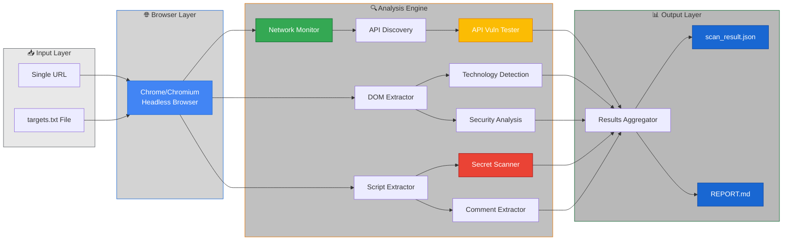
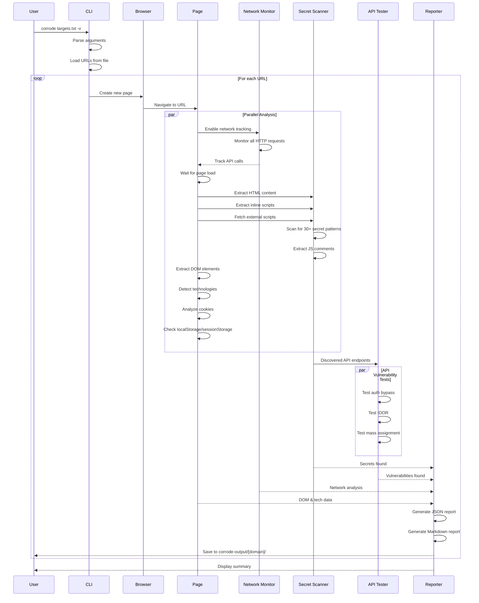
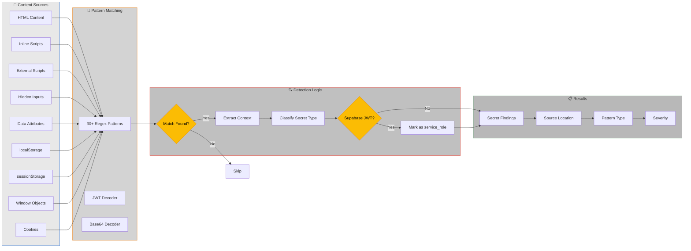

# 🦀 Corrode

**High-performance security scanner for finding exposed credentials, secrets, and vulnerabilities in web applications**

Built with Rust and chromiumoxide for blazing-fast concurrent scanning with comprehensive security analysis.

## Architecture

### High-Level Architecture



### Scanning Workflow



### Secret Detection Pipeline



## Features

### Core Scanning Capabilities
- ⚡ **Concurrent Scanning** - Scan multiple sites simultaneously with configurable concurrency
- 🔍 **Deep Analysis** - Extracts and scans HTML, JavaScript bundles, inline scripts, and external resources
- 🌐 **Network Monitoring** - Tracks all HTTP requests, API calls, and third-party domains
- 🎯 **Pattern Matching** - Detects 30+ types of secrets and credentials
- 📊 **Comprehensive Reporting** - JSON results and detailed Markdown reports per site
- 🚀 **Bulk Scanning** - Point to a text file with URLs and scan them all

### Advanced Analysis
- 🔐 **API Discovery** - Automatically discovers API endpoints from JavaScript code
- 🎯 **API Vulnerability Testing** - Tests for authentication bypass, IDOR, and other API vulnerabilities
- 💬 **Comment Extraction** - Extracts JavaScript comments that may contain sensitive information
- 🛠️ **Technology Detection** - Identifies 40+ frameworks, libraries, and services in use
- 🔎 **DOM Analysis** - Analyzes forms, hidden inputs, iframes, meta tags, and data attributes
- 🍪 **Cookie Security Analysis** - Checks for insecure cookie configurations
- 🪟 **Window Object Inspection** - Extracts sensitive data from window objects (Next.js, Nuxt, etc.)
- 📍 **Source Map Detection** - Identifies exposed source maps

## Installation

### Method 1: Quick Install (Recommended)

Install Corrode globally so you can run it from anywhere with just `corrode`:

```bash
# Clone the repository
git clone https://github.com/ul0gic/corrode.git
cd corrode

# Install using the install script
./install.sh
```

Or using Make:
```bash
make install
```

After installation, you can run Corrode from anywhere:
```bash
corrode --help
corrode targets.txt
```

### Method 2: Manual Installation

```bash
# Build the release binary
cargo build --release

# Copy to your PATH (requires sudo)
sudo cp target/release/corrode /usr/local/bin/
sudo chmod +x /usr/local/bin/corrode

# Now you can use: corrode
```

### Method 3: Local Build (No Installation)

```bash
# Build the release binary
cargo build --release

# Run from the project directory
./target/release/corrode --help
```

### Method 4: Cargo Install

```bash
# Install directly from the repository (future)
cargo install --path .

# Or once published to crates.io:
cargo install corrode
```

### Uninstallation

```bash
# Using make
make uninstall

# Or manually
sudo rm /usr/local/bin/corrode
```

### Build Requirements

- Rust 1.70+ (install from [rustup.rs](https://rustup.rs))
- Chrome/Chromium browser installed at `/usr/bin/google-chrome`
- Linux/macOS (Windows support planned)

### Available Make Commands

Once you have the repository cloned:

```bash
make help       # Show all available commands
make build      # Build debug binary
make release    # Build optimized release binary
make install    # Install to /usr/local/bin
make uninstall  # Remove from /usr/local/bin
make clean      # Clean build artifacts
make test       # Run tests
```

## Usage

### Quick Start

By default, Corrode looks for a `targets.txt` file in the current directory:

```bash
# Create your targets file
echo "https://example.com" > targets.txt

# Run the scanner
./target/release/corrode
```

### Command Line Options

```
High-performance security scanner for exposed credentials and vulnerabilities

Usage: corrode [OPTIONS] <TARGET>

Arguments:
  <TARGET>
          Target URL or file path

          Can be:
            - Single URL: https://example.com
            - File with URLs: targets.txt (one URL per line, # for comments)
            - Any .txt file or path that exists will be treated as a URL list

          [default: targets.txt]

Options:
  -c, --concurrency <NUM>
          Number of concurrent browser instances

          Higher values = faster scans but more resource usage.
          Recommended: 10-20 for most systems, 50+ for powerful machines.

          [default: 10]

  -o, --output <DIR>
          Output directory for scan results

          Results saved as: <OUTPUT>/<domain>/scan_result.json and REPORT.md

          [default: corrode-output]

  -t, --timeout <SECS>
          Timeout for page load in seconds

          Maximum time to wait for a page to load before moving on.

          [default: 30]

  -v, --verbose
          Enable verbose output

          Shows detailed progress, found secrets, and API test results in real-time.

  -h, --help
          Print help (see a summary with '-h')

  -V, --version
          Print version
```

### Usage Examples

**Scan with default targets.txt:**
```bash
./target/release/corrode
```

**Scan a single URL:**
```bash
./target/release/corrode https://example.com
```

**Scan multiple URLs from a custom file:**
```bash
./target/release/corrode my-targets.txt
```

**High-speed bulk scanning:**
```bash
# 50 concurrent scans with verbose output
./target/release/corrode targets.txt -c 50 -v
```

**Custom output directory:**
```bash
# Save results to dated directory
./target/release/corrode targets.txt -o recon-$(date +%Y%m%d)
```

**Extended timeout for slow sites:**
```bash
# 60 second timeout instead of default 30
./target/release/corrode targets.txt -t 60 -v
```

## Example URLs File

Create a `targets.txt` (any .txt file works):
```
https://example.com
https://another-site.com
https://app.startup.io
# Comments are ignored
https://api.service.com
```

**Note**: The scanner accepts any .txt file or checks if the provided path exists as a file. If it's a file, it reads URLs line by line; otherwise, it treats the argument as a single URL.

## Detected Secrets & Credentials

Corrode detects 30+ types of secrets and credentials:

### Authentication & Authorization
- 🔑 **JWT Tokens** - Including Supabase service_role detection
- 🔑 **Bearer Tokens** - Authorization header tokens
- 🔑 **Basic Auth** - Base64 encoded credentials
- 🔐 **OAuth Client Secrets** - Google OAuth and others
- 🔒 **Private Keys** - RSA, EC, and OpenSSH private keys

### Cloud Providers
- ☁️ **AWS Access Keys** - AKIA keys
- ☁️ **AWS Secret Keys** - Secret access keys
- ☁️ **AWS ARN** - Amazon Resource Names
- 🔥 **Firebase API Keys** - AIza keys
- 🗄️ **Supabase URLs** - Project URLs
- 🗄️ **Supabase Anon Keys** - Anonymous keys
- ☁️ **Heroku API Keys** - UUID format keys

### Payment & Financial
- 💳 **Stripe Live Keys** - sk_live keys
- 💳 **Stripe Restricted Keys** - rk_live keys

### Communication & Collaboration
- 💬 **Slack Tokens** - xox tokens
- 💬 **Slack Webhooks** - Webhook URLs
- 📧 **SendGrid Keys** - SG keys
- 📧 **Mailgun Keys** - API keys
- 📧 **Mailchimp Keys** - API keys
- 📞 **Twilio Keys** - SK keys
- 📞 **Twilio Account SIDs** - AC identifiers

### Version Control & Development
- 🐙 **GitHub Tokens** - Personal access tokens (classic and fine-grained)
- 🦊 **GitLab Tokens** - Personal access tokens
- 💬 **Discord Tokens** - Bot and webhook tokens

### Database Connection Strings
- 🗄️ **PostgreSQL URLs** - Connection strings with credentials
- 🗄️ **MongoDB URLs** - Connection strings with credentials
- 🗄️ **MySQL URLs** - Connection strings with credentials
- 🗄️ **Redis URLs** - Connection strings with credentials

### Other
- 🌐 **IP Addresses** - Internal IP exposure
- 🔗 **JWT in URLs** - Tokens passed in query parameters

## Vulnerability Detection

### API Security Testing
- 🔓 **Authentication Bypass** - Tests if APIs are accessible without credentials
- 🎯 **IDOR (Insecure Direct Object Reference)** - Tests for unauthorized access to objects
- 🔑 **Missing Authentication Checks** - Identifies endpoints that don't validate tokens
- 📂 **Publicly Accessible APIs** - Finds APIs returning data without authentication
- ⚠️ **Mass Assignment** - Tests for dangerous parameter injection

### Security Issues
- 🍪 **Insecure Cookies** - Missing Secure, HttpOnly, or SameSite flags
- 🐛 **Debug Mode Detection** - Identifies debug mode enabled in production
- 📍 **Source Map Exposure** - Flags exposed source maps that aid reverse engineering
- 🔍 **CORS Issues** - Detects problematic CORS configurations
- 🔓 **Mixed Content** - Identifies insecure resources on HTTPS pages

### Technology Detection

Corrode automatically identifies 40+ technologies:

**Frameworks**: React, Vue.js, Angular, Svelte, Solid.js, Next.js, Nuxt.js, Remix, Gatsby
**Backend-as-a-Service**: Supabase, Firebase, Appwrite, AWS Cognito
**Authentication**: Auth0, Clerk, Okta
**Payment**: Stripe, PayPal, Square, Braintree
**Analytics**: Google Analytics, Mixpanel, Segment, Amplitude, HubSpot
**CMS**: WordPress, Drupal, Webflow, Contentful, Sanity
**Libraries**: jQuery, Bootstrap, Tailwind CSS, Material-UI
**State Management**: Redux, MobX, Zustand, Apollo Client, Relay

## Output

Results are saved in `corrode-output/[domain]/`:

**scan_result.json** - Complete JSON scan data:
```json
{
  "url": "https://example.com",
  "timestamp": "2025-11-09T12:00:00Z",
  "secrets": {...},
  "network": {
    "total_requests": 45,
    "api_calls": [...],
    "third_party": [...]
  },
  "dom": {...},
  "javascript": {...},
  "security": {...},
  "technologies": ["React", "Next.js", "Supabase"],
  "vulnerabilities": [...],
  "api_tests": [...],
  "comments": [...],
  "success": true
}
```

**REPORT.md** - Human-readable security report with:
- Executive summary with risk level
- All detected secrets and credentials
- Vulnerabilities categorized by severity
- API security test results
- JavaScript analysis findings
- DOM and technology stack information
- Actionable remediation recommendations


## Performance

- **Node.js (Puppeteer)**: ~5-10s per site, 1-3 concurrent
- **Rust (corrode)**: ~3-5s per site, 50+ concurrent

Scan 100 sites:
- Node: ~15 minutes
- Rust: ~30 seconds

## Roadmap & Features in Progress

- [ ] GraphQL schema extraction and testing
- [ ] WebSocket monitoring and analysis
- [ ] Enhanced header security analysis
- [ ] SQL injection pattern detection in discovered endpoints
- [ ] XSS vulnerability testing
- [ ] Enhanced CORS misconfiguration detection
- [ ] Browser storage (localStorage/sessionStorage) security analysis
- [ ] Custom pattern definitions via config file
- [ ] HTML report generation
- [ ] Integration with vulnerability databases

## Disclaimer

**IMPORTANT: For Authorized Security Testing Only**

This tool is designed for legitimate security research, penetration testing, and vulnerability assessment. By using Corrode, you agree to the following:

- ✅ Only scan websites and applications you own or have explicit written permission to test
- ✅ Use this tool for defensive security purposes, security research, and authorized penetration testing
- ✅ Comply with all applicable laws and regulations in your jurisdiction
- ✅ Respect responsible disclosure practices for any vulnerabilities discovered

**We are NOT responsible for:**
- ❌ Any unauthorized scanning or testing of websites without permission
- ❌ Any damage, legal consequences, or violations resulting from misuse of this tool
- ❌ Any actions taken based on the scan results
- ❌ False positives or missed vulnerabilities in scan results

**Legal Notice**: Unauthorized access to computer systems is illegal under laws such as the Computer Fraud and Abuse Act (CFAA) in the United States and similar legislation in other countries. Always obtain proper authorization before testing.

## License

Corrode is licensed under the **GNU Affero General Public License v3.0 (AGPL-3.0)** with Corelift LLC (ul0gic) retaining full copyright over the codebase. See `LICENSE` for the complete terms. Highlights:
- ✅ Any modifications or derivative works must remain AGPL and be published when distributed or offered as a hosted service.
- ✅ Attribution to Corelift LLC and ul0gic is required in downstream forks and hosted deployments.
- ✅ Free for security research, internal assessments, and community contributions; commercial users can contact us for dual-licensing options.
- ❌ No closed-source redistribution, SaaS rebranding, or proprietary embedding without a commercial agreement.

As the original author, Corelift LLC can still dual-license Corrode (e.g., for PenPal integrations) while keeping the community version open under AGPL-3.0.

## Contributing

Read `CONTRIBUTING.md` before opening a PR. Key points:
- ✅ All patches are accepted under AGPL-3.0 and may be dual-licensed by Corelift LLC (ul0gic).
- ✅ Public shoutouts, talks, and demos must credit Corelift LLC and ul0gic.
- ❌ You cannot fork Corrode, strip attribution, and resell it or run it as a closed-source SaaS without a Corelift LLC agreement.

Questions about contributions or commercial licensing? Open an issue or contact the Corelift LLC team.

## Quick Reference

### Common Commands

```bash
# Install globally
./install.sh
# or
make install

# Scan with default targets.txt
corrode

# Scan a specific URL
corrode https://example.com

# Bulk scan with high concurrency
corrode targets.txt -c 50 -v

# View help
corrode --help
corrode -h

# Uninstall
make uninstall
```

### File Structure After Installation

```
corrode/
├── install.sh              # Installation script
├── Makefile                # Build automation
├── targets.txt             # Your target URLs (create this)
├── corrode-output/         # Scan results (auto-created)
│   └── example-com/
│       ├── scan_result.json
│       └── REPORT.md
└── src/                    # Source code
```

## Contact

For questions, issues, or security concerns, please open an issue on GitHub.
