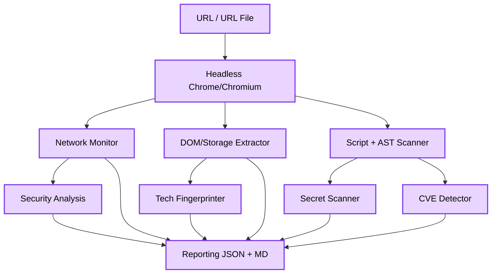

# Corrode

**Passive reconnaissance tool for extracting secrets, credentials, and security-relevant data from web applications**

Built with Rust and chromiumoxide for fast, headless scanning. Corrode performs passive analysis only — no active exploitation or fuzzing. Use its output to inform manual penetration testing and security assessments.

[](https://github.com/ul0gic/corrode/actions/workflows/ci.yml)
[](https://crates.io/crates/corrode-scanner)
[](https://crates.io/crates/corrode-scanner)
[](https://www.rust-lang.org/)
[](LICENSE)

## Project Structure

```
src/
├── api/                  # API endpoint discovery (passive extraction from JS)
├── cli.rs                # CLI definitions
├── config.rs             # Config normalization and config file loading
├── detectors/
│   ├── patterns/         # Pattern modules: auth, cloud, ai, payment, communication,
│   │                     #   monitoring, collaboration, vcs, database, infrastructure
│   ├── secrets.rs        # SecretScanner engine
│   ├── ast.rs            # SWC-based JavaScript AST analysis
│   ├── cve.rs            # Next.js CVE version-range detectors
│   ├── dom.rs            # DOM analysis: forms, hidden inputs, cookies, storage
│   ├── javascript.rs     # Script extraction, window objects, runtime detection
│   ├── jwt.rs            # JWT decoding and role classification
│   └── security.rs       # Cookie/header/CORS security analysis
├── network/              # Network monitor
├── reporting/
│   └── markdown/         # Section-based Markdown report: summary, findings,
│                         #   network, technologies, appendix
├── scanner/
│   ├── chrome.rs         # Chrome binary resolution
│   └── workflow.rs       # Browser orchestration and scan workflow
├── types.rs              # Shared data structures
└── main.rs               # Entry point
fixtures/                 # Static fixture pages for local testing
corrode-output/           # Default output directory (per scan)
examples/                 # Example configuration files
```

## Architecture


```mermaid
graph TD
    A[URL / URL File] --> B[Headless Chrome/Chromium]
    B --> C[Network Monitor]
    B --> D[DOM/Storage Extractor]
    B --> E[Script + AST Scanner]
    E --> G[Secret Scanner]
    D --> H[Tech Fingerprinter]
    C --> I[Security Analysis]
    E --> J[CVE Detector]
    G --> Results[Reporting JSON + MD]
    C --> Results
    D --> Results
    H --> Results
    I --> Results
    J --> Results

    classDef purple fill:#e9d5ff,stroke:#7c3aed,stroke-width:2px,color:#000
    class A,B,C,D,E,F,G,H,I,J,Results purple
```

## Features

### Core Scanning Capabilities
- **Fast Headless Scanning** - Optimized Chromium workflow for low-latency scans
- **Deep Analysis** - Extracts and scans HTML, JavaScript bundles, inline scripts, and external resources
- **Network Monitoring** - Tracks all HTTP requests, API calls, and third-party domains
- **Pattern Matching** - Detects 45+ types of secrets and credentials across 10 service categories
- **Comprehensive Reporting** - JSON results and detailed Markdown reports per site
- **Multi-URL Batch Scanning** - Scan a list of targets from a file with `--file targets.txt`
- **Config File Support** - Persistent settings and custom patterns via `.corrode.toml`

### Advanced Analysis
- **API Endpoint Discovery** - Extracts API endpoints from JavaScript for manual testing
- **CVE Detection** - Detects React and Next.js vulnerabilities by version fingerprint (9 CVEs)
- **Technology Detection** - Identifies 40+ frameworks, libraries, and services in use
- **Version Extraction** - Extracts React and Next.js versions for CVE correlation
- **DOM Analysis** - Analyzes forms, hidden inputs, iframes, meta tags, and data attributes
- **Cookie Security Analysis** - Checks for insecure cookie configurations
- **Window Object Inspection** - Extracts sensitive data from 17 window globals (`__NEXT_DATA__`, `__APOLLO_STATE__`, `__remixContext`, and more)
- **Environment Variable Detection** - Flags exposed `REACT_APP_*`, `NEXT_PUBLIC_*`, and `VITE_*` variables
- **Debug Mode Detection** - Identifies React development builds, Vue devtools, and HMR signals in production
- **Source Map Detection** - Identifies exposed source maps via headers, comments, and CSS

## Installation

### Install via Cargo

```bash
cargo install corrode-scanner
```

For local development (from source):
```bash
git clone https://github.com/ul0gic/corrode.git
cd corrode
cargo build --release
./target/release/corrode-scanner --url https://example.com
```

### Requirements

| Requirement          | Details                                    |
| -------------------- | ------------------------------------------ |
| Rust                 | 1.70+ (install from [rustup.rs](https://rustup.rs)) |
| Chrome/Chromium      | Required for headless scanning (see below) |
| OS                   | Linux/macOS                                |

#### Installing Chrome/Chromium

**Linux (Debian/Ubuntu):**
```bash
wget -q -O - https://dl.google.com/linux/linux_signing_key.pub | sudo gpg --dearmor -o /usr/share/keyrings/google-chrome.gpg
echo "deb [arch=amd64 signed-by=/usr/share/keyrings/google-chrome.gpg] http://dl.google.com/linux/chrome/deb/ stable main" | sudo tee /etc/apt/sources.list.d/google-chrome.list
sudo apt update && sudo apt install -y google-chrome-stable
```

**macOS:**
```bash
brew install --cask google-chrome
```

Chrome is auto-detected via PATH and common install locations. Override with `--chrome-bin <path>` or `CHROME_BIN` env var if needed.

## Usage

### Command Line Options

| Flag / Option          | Description                                                             | Default           | Required |
| ---------------------- | ----------------------------------------------------------------------- | ----------------- | -------- |
| `--url <URL>`          | Target URL to scan                                                      | –                 | One of --url or --file |
| `--file <PATH>`        | File containing URLs to scan (one per line, `#` comments allowed)       | –                 | One of --url or --file |
| `-o, --output <DIR>`   | Output directory (`<output>/<domain>/scan_result.json`, `REPORT.md`)    | `corrode-output`  |          |
| `--chrome-bin <PATH>`  | Path to Chrome/Chromium binary (overrides auto-detect)                  | auto-detect       |          |
| `-t, --timeout <s>`    | Page-load timeout in seconds                                            | `30`              |          |
| `-v, --verbose`        | Verbose progress + findings                                             | off               |          |
| `--format <fmt>`       | Output format: `json`, `md`, or `both`                                  | `md`              |          |
| `--config <PATH>`      | Path to a custom `.corrode.toml` config file                            | auto-discover     |          |
| `--no-config`          | Ignore all config files, use built-in defaults only                     | off               |          |
| `-h, --help`           | Show help                                                               | –                 |          |
| `-V, --version`        | Show version                                                            | –                 |          |

### Usage Examples

Single target:
```bash
corrode-scanner --url https://example.com
```

Batch scan from a file:
```bash
corrode-scanner --file targets.txt
```

Custom output directory and timeout:
```bash
corrode-scanner --url https://example.com -o recon-$(date +%Y%m%d) -t 60 -v
```

JSON output only:
```bash
corrode-scanner --url https://example.com --format json
```

Explicit Chrome binary override:
```bash
corrode-scanner --url https://example.com --chrome-bin "/Applications/Google Chrome.app/Contents/MacOS/Google Chrome"
```

Use a specific config file:
```bash
corrode-scanner --url https://example.com --config /path/to/corrode.toml
```

Skip config file entirely:
```bash
corrode-scanner --url https://example.com --no-config
```

### Batch Scanning (`--file`)

Create a target file with one URL per line. Blank lines and lines starting with `#` are ignored:

```
# Production targets
https://app.example.com
https://api.example.com

# Staging
https://staging.example.com
```

Scan all targets:
```bash
corrode-scanner --file targets.txt -o pentest-$(date +%Y%m%d)
```

Corrode scans each URL in sequence, continues past failures, and writes a `SUMMARY.md` in the output root with per-target finding counts.

## Configuration

Corrode auto-discovers `.corrode.toml` in the following order:
1. `--config <PATH>` explicit override
2. `./corrode.toml` in the current directory
3. `~/.config/corrode/config.toml` global config

CLI flags always take priority over config file values.

See `examples/corrode.toml` for a fully documented example with all supported options.

### Minimal example:

```toml
[scan]
timeout = 60
verbose = true
format = "both"
output_dir = "recon-output"

[patterns]
ignore_patterns = ["internal_ip"]

[[patterns.custom_patterns]]
name = "My App API Key"
pattern = 'myapp_[A-Za-z0-9]{32}'
severity = "critical"
```

## Detected Secrets & Credentials

Corrode detects 45+ types of secrets and credentials:

### Authentication & Authorization
- **JWT Tokens** - Including Supabase service_role detection
- **Bearer Tokens** - Authorization header tokens
- **Basic Auth** - Base64 encoded credentials
- **OAuth Client Secrets** - Google OAuth and others
- **Private Keys** - RSA, EC, and OpenSSH private keys

### Cloud Providers
- **AWS Access Keys** - AKIA keys
- **AWS Secret Keys** - Secret access keys
- **AWS ARN** - Amazon Resource Names
- **Firebase API Keys** - AIza keys
- **Supabase URLs** - Project URLs
- **Supabase Anon Keys** - Anonymous keys (classic and new sb_publishable_/sb_secret_ formats)
- **DigitalOcean Tokens** - doo/dop/dor_v1_ tokens
- **Vercel Tokens** - vc[pkiar]_ tokens
- **Azure Storage** - Connection strings with account names and keys
- **Azure AD Client Secrets** - Q~-prefixed secrets
- **Azure SAS Tokens** - Shared access signature tokens
- **GCP Service Accounts** - Service account email addresses
- **Cloudflare Origin CA** - v1.0-prefixed Origin CA keys
- **Heroku API Keys** - UUID format keys

### AI Providers
- **Anthropic API Keys** - sk-ant-api03- keys
- **OpenAI API Keys** - sk- keys (disambiguated from Anthropic)

### Payment & Financial
- **Stripe Publishable Keys** - pk_live/pk_test keys
- **Stripe Secret Keys** - sk_live keys
- **Stripe Restricted Keys** - rk_live keys
- **Plaid Secrets** - Client ID and secret pairs

### Communication & Collaboration
- **Slack Tokens** - xox tokens
- **Slack Webhooks** - Webhook URLs
- **SendGrid Keys** - SG keys
- **Mailgun Keys** - API keys
- **Mailchimp Keys** - API keys
- **Twilio Keys** - SK keys
- **Twilio Account SIDs** - AC identifiers
- **Postmark Tokens** - Server and account tokens
- **Discord Tokens** - Bot and webhook tokens

### Monitoring & Observability
- **Sentry DSN** - Project DSN URLs
- **Sentry Auth Tokens** - sntrys_- prefixed tokens
- **Datadog API Keys** - Context-anchored key detection
- **Datadog App Keys** - Context-anchored application key detection
- **PagerDuty API Keys** - Context-anchored token detection

### Project Management & Collaboration
- **Linear API Keys** - lin_ prefixed tokens
- **Notion API Keys** - ntn_ prefixed tokens
- **Algolia Keys** - Context-anchored API key detection
- **Mapbox Tokens** - pk./sk./tk. JWT-encoded tokens

### Version Control & Development
- **GitHub Tokens** - Personal access tokens (classic and fine-grained)
- **GitLab Tokens** - Personal access tokens

### Database Connection Strings
- **PostgreSQL URLs** - Connection strings with credentials
- **MongoDB URLs** - Connection strings with credentials
- **MySQL URLs** - Connection strings with credentials
- **Redis URLs** - Connection strings with credentials

### Infrastructure & Environment
- **Internal IPs** - Private network IP exposure (10.x, 172.16-31.x, 192.168.x)
- **JWT in URLs** - Tokens passed in query parameters
- **Netlify Tokens** - nfp_ prefixed tokens
- **Exposed Env Vars** - REACT_APP_*, NEXT_PUBLIC_*, VITE_* references in JS

## CVE Detection

Corrode detects React and Next.js vulnerabilities by fingerprinting version strings and RSC module markers found in JavaScript bundles. When a version is confirmed vulnerable, findings are emitted at the researched severity. When Next.js is detected but the version is unknown, an informational advisory is emitted.

| CVE | Component | Severity | Affected Versions | Type |
|-----|-----------|----------|-------------------|------|
| CVE-2025-55182 | React Server Components | Critical | react-server-dom-webpack < 19.1.0 | RCE |
| CVE-2025-55183 | React Server Components | Medium | 19.0.0 – 19.2.2 | Source Code Exposure |
| CVE-2025-55184 / CVE-2025-67779 | React Server Components | High | 19.0.0 – 19.2.2 | DoS |
| CVE-2026-23864 | React Server Components | High | 19.0.0 – 19.2.3 | DoS |
| CVE-2025-29927 | Next.js Middleware | Critical | < 15.2.3 | Auth Bypass |
| CVE-2024-34351 | Next.js | High | < 14.1.1 | SSRF |
| CVE-2024-46982 | Next.js | High | < 14.2.10 | Cache Poisoning |
| CVE-2024-51479 | Next.js | High | 14.2.0 – 14.2.15 | Auth Bypass |
| CVE-2024-56332 | Next.js | Medium | < 15.1.7 | DoS |

## Security Issue Detection
- **Insecure Cookies** - Missing Secure, HttpOnly, or SameSite flags
- **CORS Misconfiguration** - Detects wildcard Access-Control-Allow-Origin headers
- **Missing Security Headers** - CSP, HSTS, X-Frame-Options, X-Content-Type-Options
- **Mixed Content** - HTTP resources loaded on HTTPS pages
- **Debug Mode Detection** - React development builds, Vue devtools, Angular debug, HMR signals in production
- **Source Map Exposure** - Flags exposed source maps via `sourceMappingURL` comments, `SourceMap` headers, and CSS source maps

### Technology Detection

Corrode automatically identifies 40+ technologies:

**Frameworks**: React, Vue.js, Angular, Svelte, Solid.js, Next.js, Nuxt.js, Remix, Gatsby
**Backend-as-a-Service**: Supabase, Firebase, Appwrite, AWS Cognito
**Authentication**: Auth0, Clerk, Okta
**Payment**: Stripe, PayPal, Square, Braintree
**Analytics**: Google Analytics, Mixpanel, Segment, Amplitude, HubSpot
**CMS**: WordPress, Drupal, Webflow, Contentful, Sanity
**Libraries**: jQuery, Bootstrap, Tailwind CSS, Material-UI
**State Management**: Redux, MobX, Zustand, Apollo Client, Relay

## Disclaimer

**IMPORTANT: For Authorized Security Testing Only**

This tool is designed for legitimate security research, penetration testing, and vulnerability assessment. By using Corrode, you agree to the following:

- Only scan websites and applications you own or have explicit written permission to test
- Use this tool for defensive security purposes, security research, and authorized penetration testing
- Comply with all applicable laws and regulations in your jurisdiction
- Respect responsible disclosure practices for any vulnerabilities discovered

**We are NOT responsible for:**
- Any unauthorized scanning or testing of websites without permission
- Any damage, legal consequences, or violations resulting from misuse of this tool
- Any actions taken based on the scan results
- False positives or missed vulnerabilities in scan results

**Legal Notice**: Unauthorized access to computer systems is illegal under laws such as the Computer Fraud and Abuse Act (CFAA) in the United States and similar legislation in other countries. Always obtain proper authorization before testing.

Corrode is provided by **ul0gic** on an "as-is" basis with no warranty. You assume all responsibility for how you use the tool.

## License

Corrode is licensed under the **GNU Affero General Public License v3.0 (AGPL-3.0)**. See `LICENSE` for the complete terms. Highlights:
- Any modifications or derivative works must remain AGPL and be published when distributed or offered as a hosted service.
- Keep attribution to **ul0gic** and the Corrode project in downstream forks and hosted deployments.
- Free for security research, internal assessments, and community contributions — commercial users simply follow the same AGPL requirements.
- The software is provided without warranty; use it only when you have authorization.

## Contributing

Read `CONTRIBUTING.md` before opening a PR. Key points:
- All patches are accepted under AGPL-3.0 and you confirm you have the right to contribute the code.
- Public shoutouts, talks, and demos must credit Corrode and ul0gic.
- Redistributed builds must keep license headers, this disclaimer, and README attribution intact.

Questions about contributions? Open an issue or ping @ul0gic on GitHub.

## Contact

For questions, issues, or security concerns, please open an issue on GitHub.
